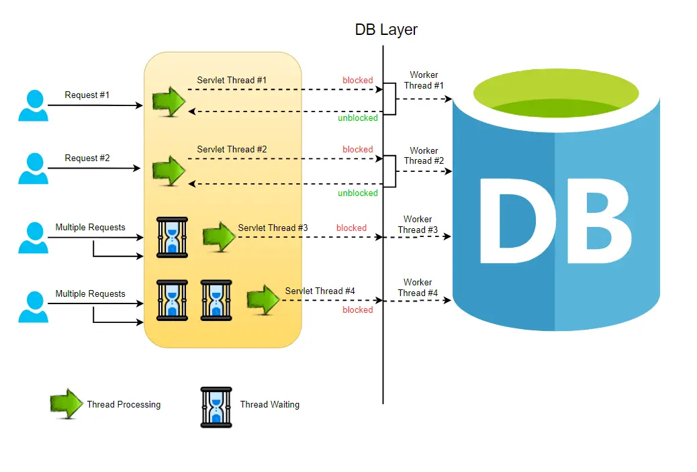
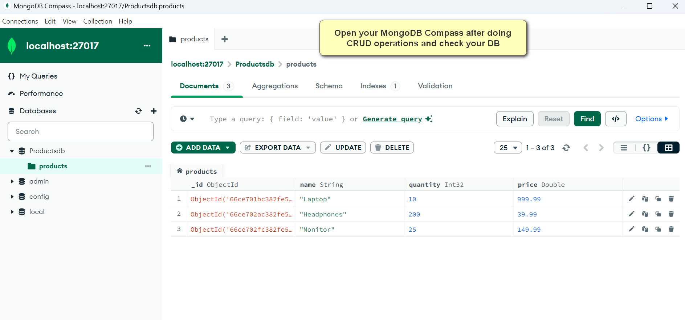
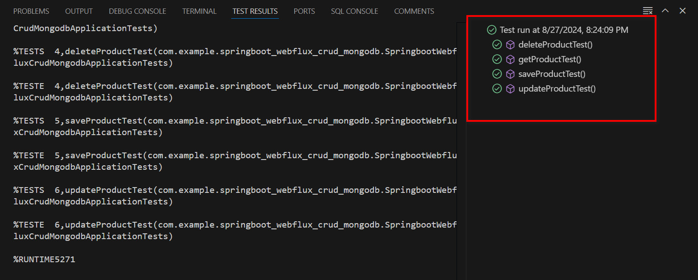

# Spring Boot WebFlux CRUD Application with MongoDB

This project demonstrates a CRUD (Create, Read, Update, Delete) application built using Spring Boot and the WebFlux framework, integrated with MongoDB as a reactive database. It provides a RESTful API for managing product data, showcasing the power of reactive programming in building scalable and efficient web applications.

## Why WebFlux?

### Reactive Programming with WebFlux
WebFlux is a reactive framework from Spring that supports non-blocking, asynchronous operations. It enables applications to handle a large number of concurrent connections with fewer hardware resources, which is ideal for high-performance and scalable microservices.

### Difference Between Traditional REST API and WebFlux

#### Traditional REST API:
- **Synchronous and Blocking:** Operates in a request-response manner, holding the thread until the operation completes.
- **Less Efficient Under Load:** Can become a bottleneck under high load, as each request consumes a thread from a limited pool.

#### WebFlux:
- **Asynchronous and Non-blocking:** Does not block the thread while waiting for data, freeing it to handle other tasks.
- **Highly Scalable:** More efficient in handling more requests with fewer threads, particularly beneficial for I/O-bound applications.
- 


### Practical Scenarios

#### When to Use WebFlux:
- **Real-time Data Processing:** Ideal for applications that require real-time updates with minimal delay, such as live notifications or streaming services.
- **Highly Concurrent Requests:** Applications that need to efficiently manage numerous concurrent requests, like real-time analytics or monitoring dashboards.

#### When to Use Traditional REST API:
- **Simple CRUD Operations:** Sufficient for applications with low to moderate load and where simplicity of development is a priority.
- **Legacy Systems Integration:** Better suited for integrating with systems that do not support reactive programming.

## Prerequisites

- Java 17 or higher
- Maven 3.6 or later
- MongoDB server running locally or accessible via the network

## Dependencies

The project uses the following key dependencies:

- `spring-boot-starter-data-mongodb-reactive`: For reactive MongoDB support.
- `spring-boot-starter-webflux`: To enable reactive web applications.
- `lombok`: To reduce boilerplate code such as getters, setters, and constructors.
- `reactor-test`: For testing reactive streams.
- `de.flapdoodle.embed.mongo`: Embedded MongoDB for testing purposes.

## API Operations

### Create a Product

```java
@PostMapping
public Mono<ProductDTO> saveProduct(@RequestBody Mono<ProductDTO> productDtoMono) {
    return productService.saveProduct(productDtoMono);
}
```

### Get All Products

```java
@GetMapping
public Flux<ProductDTO> getAllProducts() {
    return productService.getAllProducts();
}
```

### Update a Product

```java
@PutMapping("/update/{id}")
public Mono<ProductDTO> updateProduct(@PathVariable String id, @RequestBody Mono<ProductDTO> productDtoMono) {
    return productService.updateProduct(id, productDtoMono);
}
```

### Delete a Product

```java
@DeleteMapping("/delete/{id}")
public Mono<Void> deleteProduct(@PathVariable String id) {
    return productService.deleteProduct(id);
}
```

## Running the Application

Ensure MongoDB is running on your system. Follow these steps to get the application up and running:

1. **Clone the Repository:**
   
   ```bash
   git clone [your-repository-url]
   cd [your-project-directory]
   ```
   
3. **Run the Application:** Use Maven to start the server:
   
   ```bash
   mvn spring-boot:run
   ```
   
The server will start at http://localhost:8081. You can access the defined endpoints using a tool like Postman or through your browser to interact with the API.






